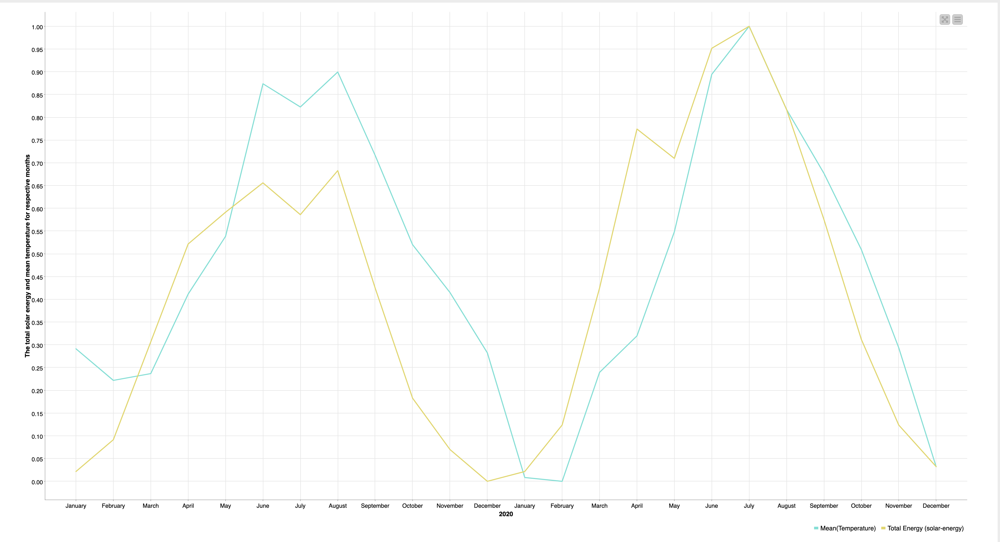
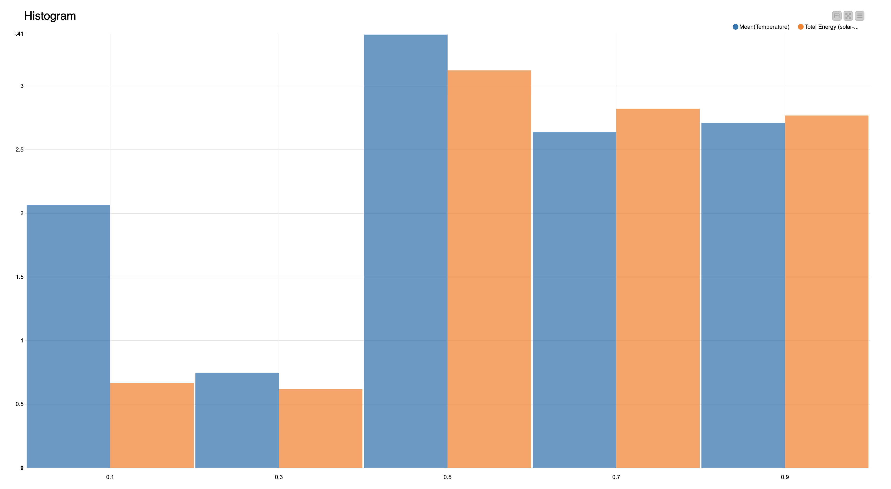
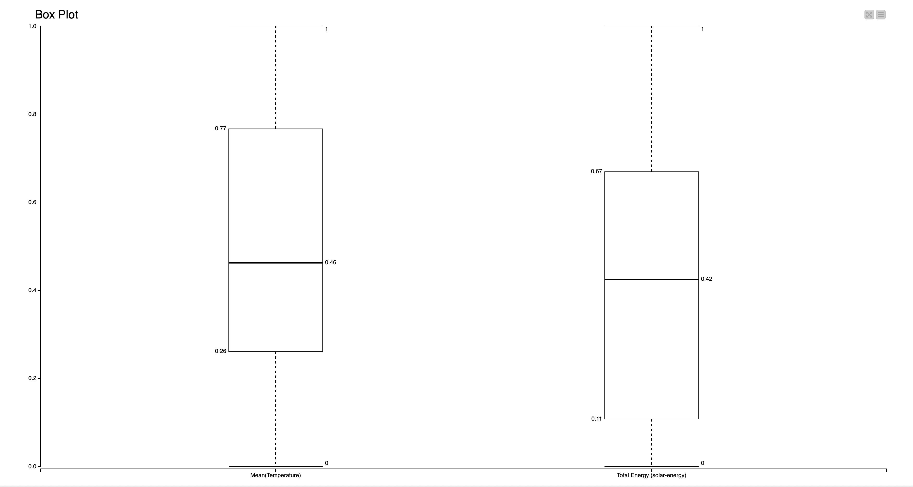
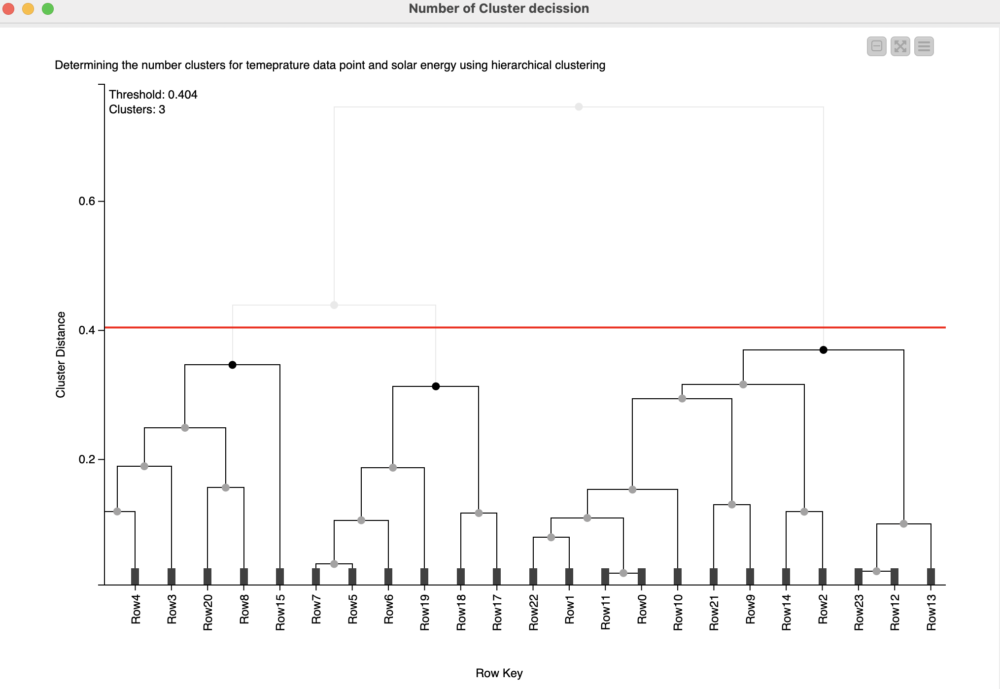
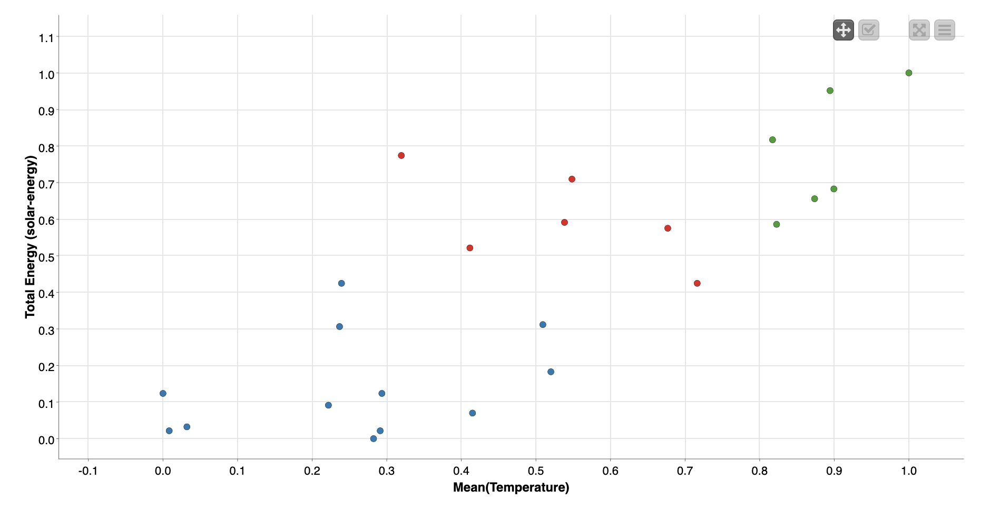
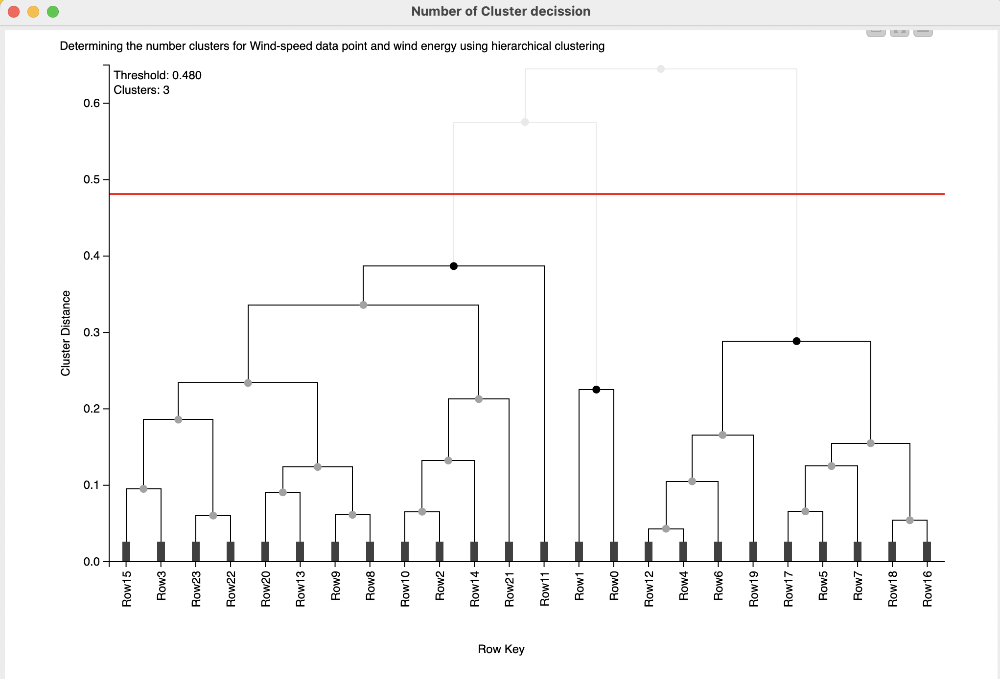
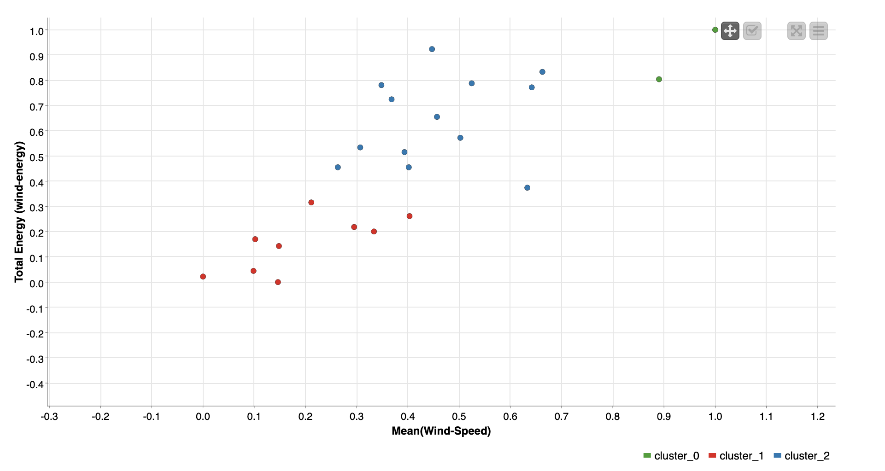
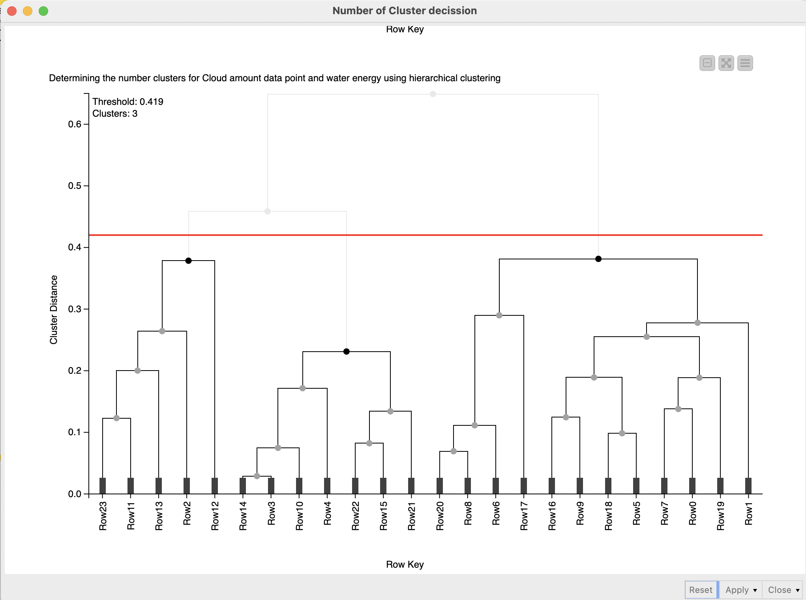
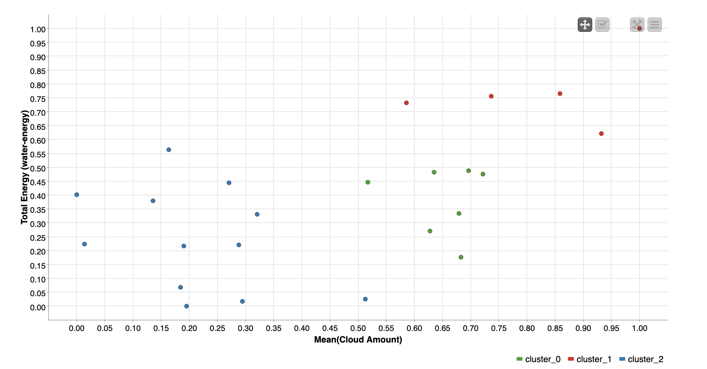

# Knime-Sweden-Energy-Weather

## Energy Production and Weather Analysis in Sweden

A KNIME workflow analyzing the relationship between Sweden's energy production and weather patterns using data from SCB and SMHI APIs.

## Project Overview

This project investigates how weather conditions affect energy production in Sweden by:
1. Collecting energy production data from Statistics Sweden (SCB)
2. Gathering weather data from Swedish Meteorological Institute (SMHI)
3. Processing and joining the datasets
4. Visualizing relationships
5. Performing cluster analysis

## Workflow Components

### 1. Data Collection
- **SCB Energy Data**: Collected via SCB's API 
- **SMHI Weather Data**: Collected from at least 4 stations with 3 variables:
  - Selected variables: [e.g., temperature, precipitation, wind speed]
  - Selected stations: [List of stations]

### 2. Data Processing
- Data cleaning and wrangling
- Monthly aggregation with multiple statistics (mean, median, min, max, etc.)
- Joining of weather and energy datasets

### 3. Analysis
- 3+ visualizations showing energy-weather relationships
- Hierarchical clustering to identify monthly patterns
- Cluster interpretation describing typical months in each group

## 🔧 Setup

### Required KNIME Extensions
1. **KNIME REST Client**  
   For API connections to SCB/SMHI:  
   `File > Install KNIME Extensions > Search "REST Client"`

2. **KNIME Python Integration**  
   Required if using Python nodes:  
   `File > Install KNIME Extensions > Search "Python"`

3. **KNIME Plotly**  
   For interactive visualizations:  
   `File > Install KNIME Extensions > Search "Plotly"`

      

         <h4 style="text-align: center;">Download KNIME Analytics Platform</h4>
         
      

   

## Execute 

1. Open `workflows/Energy_Weather_Analysis.knwf` in KNIME
2. Ensure you have these KNIME extensions installed:
   - KNIME REST Client nodes
   - KNIME JavaScript nodes
   - KNIME Plotly nodes (for visualizations)
3. The workflow should run without additional configuration
4. Execute all nodes

## Key Findings
### Solar Energy Production vs. Air Temperature (2020–2021)
 [summarizing the most interesting findings]
- "Temperature showed the strongest correlation with solar energy production"
 
   

      

         <h4 style="text-align: center;">Line Plot</h4>
         
      

      

         <h4 style="text-align: center;">Histogram Plot</h4>
         
      

   

   

      

         <h4 style="text-align: center;">Box Plot</h4>
         
      

   

   This line graph analyzes the monthly relationship between solar energy production and air temperature across 2020 and 2021.  

   #### Winter (Dec–Feb)  
   - **General trend**: Lower solar energy production due to colder temperatures.  
   - **Anomaly (Jan–Feb)**:  
   - Solar energy production **increased** while temperatures **decreased** in both years.  
   - Possible explanations:  
   - Weather station maintenance periods.  
   - Sensor malfunctions during these months.  

   #### Spring & Summer (Mar–Aug)  
   - **Direct correlation**: Rising temperatures coincided with higher solar energy production.  
   - **July 2020 exception**: Brief dip in both metrics (likely weather-related).  

   #### Autumn (Sep–Oct)  
   - Gradual **decline** in temperature and solar energy production.  

   #### Conclusion  
   "Solar energy production strongly correlates with air temperature **except in January and February**, where inverse trends suggest data reliability issues."  

## Cluster Analysis Results

Three distinct seasonal patterns emerged from cluster analysis. The data points are clustered into three clusters, and the distance between the clusters was considered for deciding the number of clusters.

### Temperature plot

  

    <h4>Hierarchical Cluster</h4>
    
  

  

    <h4>Scatter Plot</h4>
    
  

### Wind-Speed plot

  

    <h4>Hierarchical Cluster</h4>
    
  

  

    <h4>Scatter Plot</h4>
    
  

### Cloud Cluster Plot

  

    <h4>Hierarchical Cluster</h4>
    
  

  

    <h4>Scatter Plot</h4>
    
  

## Acknowledgements

- Data sources:
  - [SMHI API](https://www.smhi.se/data/)
  - [SCB API](https://www.scb.se/api/)
